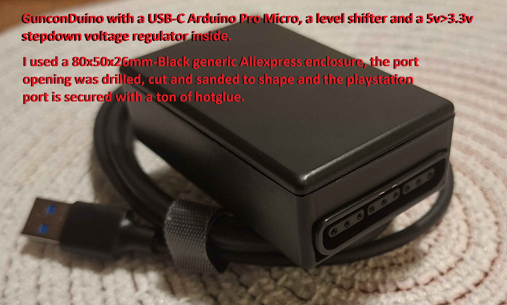
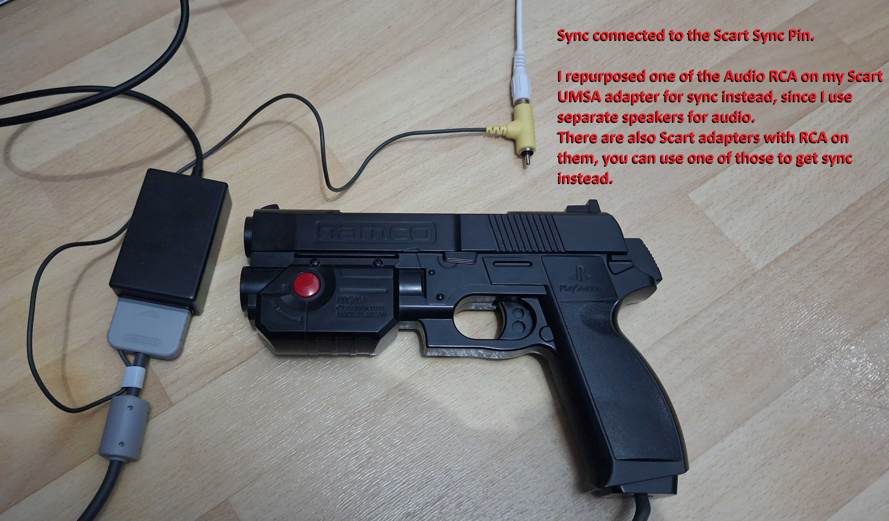
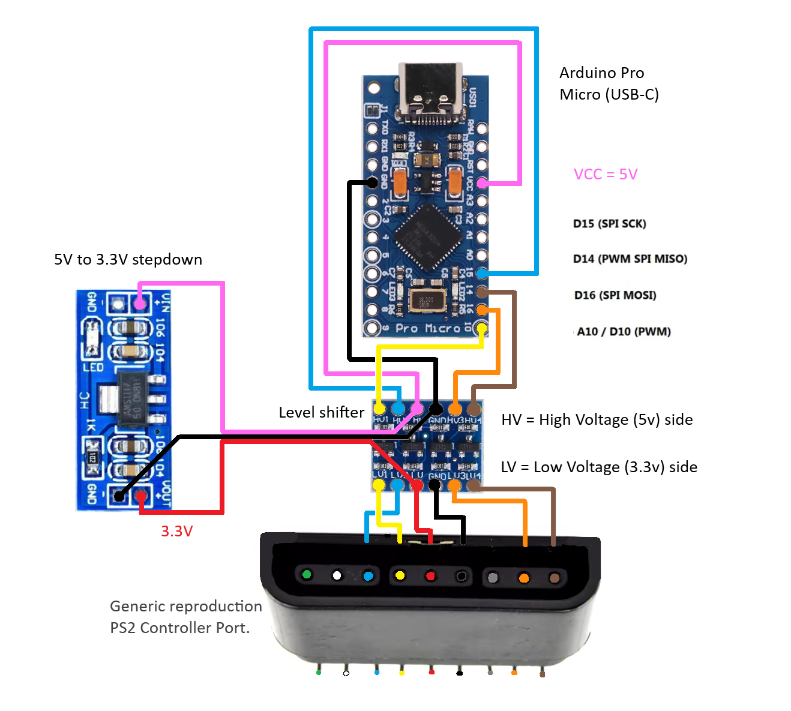
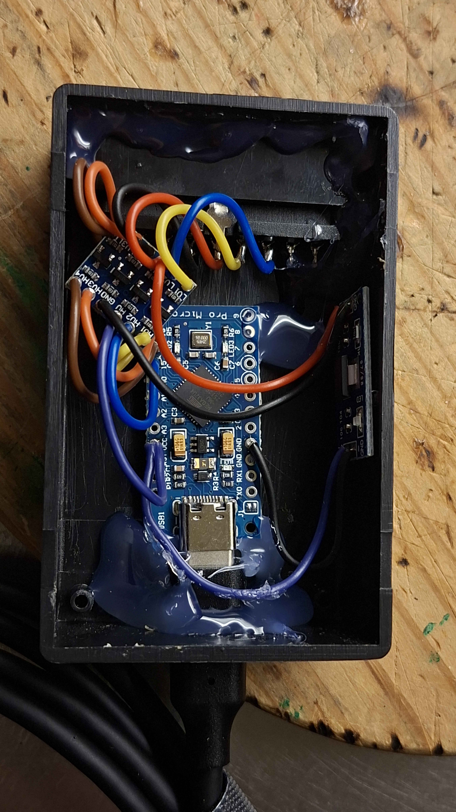

# A GunconDuino v2, With Trigger Screen Flash Support

PS1 Guncon controller as absolute Mouse coordinates (or Joystick) via Arduino Pro Micro or Leonardo.
This repository is a fork based on the original work by Matheus Fraguas (sonik-br). 

The goal of this fork was to make the GunconDuino work with RetroArch's "shader (hold)" lightgun screen flash functionality.
This ensures XY-coordinates and trigger presses always get sent together. Meaning no more missed shots when shooting at dark areas, no matter how fast you shoot.

Due to emulation lag (setup+config dependent), the built-in flash in games doesn't work. This solution allows for any lightgun game to work when set up correctly. 

This script is set for 1-3 frames of input lag (maximum), thanks to a bufferDelay that's set to 35ms "2 frames". The delay is just a timeout function, your trigger press gets sent the same instant light is sensed. Meaning shots get sent the moment shader flash happens regardless of bufferDelay, or even sent earlier than the flash if you're aiming at something that's already lit.

The bufferDelay can be set to higher value in the .ino  ```bufferDelayUs = 35000UL;``` but only resort to this if you can't bring down the setup input lag down. In my own setup I never get more than 2 frames of lag, even with polygonal games with the RA MAME core. But that's only after finding the optimal max swapchain settings etc. 

To check that the GunconDuino isn't losing shots due to lag. Shoot at a black spot in a game, if the input lag is higher than 3 frames it will not register every shot.

GunconDuino v2 in action: https://www.youtube.com/watch?v=mwm7y__UAsM 

My CRTEmudriver setup guide that I use for this can be found in the video description here: https://youtu.be/Fdo5z1mQ748

---

  

---

## Software setup (RetroArch)

* In RetroArch Hotkeys map **"Shader (hold)"** to the keyboard key **L**.
* Choose a shader (example: `shaders/misc/color-mangler.slang`) and adjust brightness/gamma to taste.
* Save the shader for the game, then disable it in the game's override config: `video_shader_enable = "false"` in `gamename.cfg`.
* Use the **rawmouse** input driver, this allows using two GunconDuino units for 2-player games.
* Select the Arduino (might be called Leonardo) as your mouse device ID. 

### Latency and video driver recommendations

* Use native RGB output setups such as **CRTEmudriver** for minimal latency.
* Use  **d3d11** or **vulkan** (setup and game dependent, 3D games should have ideal latency with vulkan on dual GPU setups, d3d11 is ideal for 2d, both can be 1-2 frames max latency) as the video driver in RetroArch.
* Adjust `video_max_frame_latency = "3"`(used with d3d11, optimal value for me) `video_max_swapchain_images = "2"` (used with vulkan, optimal value for me). 
* The wrong values for the settings above can cost several frames of latency, check these values for individual games in the `Preset-configs\config/MAME\` folder.
* Try with and without frame delay, shoot at dark targets, shoot in the bottom right corner (it should always register).
* Change threaded rendering in both RA and the MAME core options+.ini.

Preset configs for this setup are included in the `Preset-configs` folder, copy or compare them with your own configs.

---

## Usage & mappings

**Calibration:** Move the gun across a fully lit screen (left-right, top-bottom) to capture min/max screen values. Calibration updates min/max until the trigger is pressed **5 times**, at which point calibration locks. Reconnecting the Arduino requires recalibration.


>Trigger = Left-Click (and keyboard "L" pulse for shader flash)
>A = Right-Click
>B = Middle-Click
>Press "Trigger" after plugging in for "Absolute Mouse XY mode" (most lightgun games use this).
>Press "A" after plugging in for "Joystick mode" 
>(Joystick mode is for positional-analog gun games rather than light ones, remember to enable the Hold-XY mode (toggle)
>for continous shots to work, still sends mouse clicks for buttons).

>Disable/re-enable the GunconDuino: Press A+B+Trigger to disable the GunconDuino (unsticks mouse controls,
>allows you to use a regular mouse again). 
>Press Trigger again to re-enable mouse mode, or press the A-button to enable joystick mode instead.

>XY-Freeze (toggle): Hold "A + B" for 2 seconds to toggle infinite XY-Freeze. 
>This freezes XY-coordinates when light (XY) is lost and resumes XY-updates either as soon as the guncon can
>see light again or when you screen flash again with the trigger.
>
>  Useful for games that require continuous shooting games that used IR tracking originally.
>  It's also necessary for some games with "gattling guns". 
>  For example Crypt Killer that has a gun that strobes the screen at a slow rate,
>  XY-freeze-mode makes it keep XY-coordinates in-between strobe flashes, so that XY is there when the game asks for position.


**MAME / RetroArch mapping notes:**

* MAME lightgun games that used real lightguns (e.g. Point Blank) use **GunX** and **GunY**. `GUNCODE_1_XAXIS and GUNCODE_1_YAXIS` in `saves/mame/cfg/` the .cfg for the game.
* In `\system\mame\ini\mame.ini`, enable lightguns (not mouse). Use my included `mame.ini` if you don't have it.
* In the MAME core options, enable the .ini read (so it reads it).
* In RetroArch's MAME core input settings, map **GunX** and **GunY** (do NOT map as MouseX/MouseY).
* You will likely need to manually edit the RetroArch and MAME-core configs, mapping via the built-in configurators may not add the required lightgun axes.

**PCSX-ReARMed (PS1, RetroArch) mapping notes**
* This core supports rawinput mouse input for guncons, meaning two players are supported (I couldn't get guncons working with swanstation)
* The following mappings are necessary for PCSX-ReArmed to recognize the trigger, A and B buttons. Inputs are also mirrored on the P1 and P2 controllers 
(so that you can do the trigger+A+B combo through the controller to exit the arcade mode in Point Blank, as this combo otherwise disables the guncon).
* I've included what settings I use in order to make PS1 lightgun games never miss an input ```video_driver = "d3d11", video_max_frame_latency = "1, video_frame_delay_auto = "true, video_frame_delay = "3"```
* Runahead works with PCSX-ReARMed, I've set it to 1 in the configs incuded in this package.

edit the retroarch.cfg accordingly:
```
//Guncon Player 1 Trigger mapping:
  input_player1_gun_trigger_btn = "3"   //Regular "gamepad" button
  input_player1_gun_trigger_mbtn = "1"   //mousebtn-left-click (mouse ID 1)

//Guncon Player 1 A button mapping:
  input_player1_gun_aux_a_btn = "4"   //Regular "gamepad" button
  input_player1_gun_aux_a_mbtn = "2"   //mousebtn-right-click (mouse ID 1)

//Guncon Player 1 B button mapping:
  input_player1_gun_aux_b_btn = "5"   //Regular "gamepad" button
  input_player1_gun_aux_b_mbtn = "3"   //mousebtn-middle-click (mouse ID 1)

//Guncon Player 2 Trigger mapping:
  input_player2_gun_trigger_btn = "3"   //Regular "gamepad" button
  input_player2_gun_trigger_mbtn = "1"   //mousebtn-left-click (mouse ID 2)

//Guncon Player 2 A button mapping:
  input_player2_gun_aux_a_btn = "4"   //Regular "gamepad" button
  input_player2_gun_aux_a_mbtn = "2"   //mousebtn-right-click (mouse ID 2)

//Guncon Player 2 B button mapping:
  input_player2_gun_aux_b_btn = "5"   //Regular "gamepad" button
  input_player2_gun_aux_b_mbtn = "3"   //mousebtn-middle-click (mouse ID 2)

//Guncon shader flash activation (any core, you can include this within an .cfg override instead, see example configs)
input_shader_hold = "l"
```

---

## How it works

* On any hardware trigger press the Arduino sends a keyboard **L** pulse (to trigger the shader flash) followed by a buffered mouse click so the game receives valid XY coordinates and a click.
* Trigger presses are continuously buffered, meaning that you can spam the trigger without missing shots even if your setup lag is 3 frames.
* If light is sensed before expected buffer release, it cancels the buffer and releases the shot instantly (the buffer is just a fallback, accommodating for laggier setups)
* The buffer releases at **42 ms**, which works with 1-3 frames of lag, but if you absolutely have to, you can increase this delay. But only do this if you've fully optimized your setup and configs for lag first.
* Light sensing has a 34ms leniency window in case light is lost before the trigger press gets sent to the game (XY will always immediately update again at any frame light is sensed, it's just there if light is lost very momentarily, so there's zero latency drawbacks with this).

* For now, due to the flash shader being in the same render pipeline as the game, it's also affected by the 2 frame lag, so the input lag becomes 5 frames total. 
In the future maybe we could have a screen flasher that bypasses the game render pipeline. 
That said with extensive testing and comparing Point Blank MAME with my real PS1, I can zip the aim left-right as fast as possible, firing at the edges
and it'll always hit them, it doesn't lag behind my hand movement and never fails delivering the shot.

Dark target (with 2 frames of emulation input lag):

```
>Trigger press
>2 Frames emu-lag (input for shader)
>1 Frame flash, XY+Trigger states sent
>2 Frames emu-lag (inputs sent to game)
>Game reaction
```

Light target (with 2 frames of emulation input lag):
```
>Trigger press
Either: XY+Trigger states gotten and sent the same frame as the Trigger press.
(if the screen could be sampled this same frame, depends on how far the CRT has drawn the frame)
Or XY+Trigger states gotten 1 frame later instead.
>2 Frames emu-lag (inputs sent to game)
>Game reaction
```

However I've included an optimization where it will instantly send the trigger and XY states if the Guncon already has light before the flash shader.
Meaning that any moderately bright thing you aim at (a majority of targets), will be down to just 2-3 frames of input lag.
And it'll be down to just 1 frame IF the game is supported by runahead (set to 2).

---

## Misc minor improvements over original GunconDuino

* Buttons polled independently at maximum rate.
* Faster screen XY polling while preserving bottom-of-CRT sensing.
* 5ms debounce, preventing double trigger click and "l" key shader flash activation.
* Joystick mode still sends mouse clicks for A/B/Trigger to not need different MAME mappings.
* A+B+Trigger disable can be peformed without pointing it at the screen, it also now ensures clicks cannot remain stuck as pressed.
* You can enable either joystick mode or mouse mode after the A+B+Trigger disable. 
* Max-min XY calibration locks after the trigger has been pressed 10 times (at any point the counter reaches 10 presses)

---

## Build instructions

**Required hardware:**
* Arduino Pro Micro (USB-C) or Leonardo.
* PS1 accessories operate at **3.3V** (you must use a 5V → 3.3V regulator)
* **Level shifter** (required, without it the Guncon may be damaged over time)
* **Arduino Pro Micro** (recommended) or **Arduino Leonardo**
* PS1/PS2 female connector 
* A suitable enclosure (I used a 80x50x26mm one)

(All of these parts are available on AliExpress)

You can custom build a circuit with a level shifter and voltage regulator, or get the shield below which integrates these components.

**Shield:**

* [https://github.com/SukkoPera/PsxControllerShield](https://github.com/SukkoPera/PsxControllerShield)

### If not using the shield (wiring with a playstation controller port, female connector):

 

The wiring inside a playstation controller cable, male connector, for reference.


### Flashing the script to the Arduino

**Libraries required:**

* [PsxNewLib](https://github.com/SukkoPera/PsxNewLib)
* [ArduinoJoystickLibrary](https://github.com/MHeironimus/ArduinoJoystickLibrary)

> I have included the libraries in this release. Remove duplicate copies from `ThisPC/Documents/Arduino/libraries/` if present.

* Flashing tip: If you have trouble flashing the `.ino` to a Pro Micro, try an older Arduino IDE version.

> Important: This project is intended for CRTs at standard resolutions and native output setups (CRTEmudriver or similar).


Official Guncons behave correctly, but third-party guns may produce incorrect readings (adjusting screen values in the script may help).

---

## Credits

* Original GunconDuino code by sonik-br: [https://github.com/sonik-br/GunconDuino](https://github.com/sonik-br/GunconDuino)
* PsxNewLib by SukkoPera: [https://github.com/SukkoPera/PsxNewLib](https://github.com/SukkoPera/PsxNewLib)
* Modified absmouse by jonathanedgecombe: [https://github.com/jonathanedgecombe/absmouse](https://github.com/jonathanedgecombe/absmouse)
* ArduinoJoystickLibrary by MHeironimus: [https://github.com/MHeironimus/ArduinoJoystickLibrary](https://github.com/MHeironimus/ArduinoJoystickLibrary)
* PS controller pinout reference by CuriousInventor: [https://store.curiousinventor.com/guides/PS2](https://store.curiousinventor.com/guides/PS2)

---
